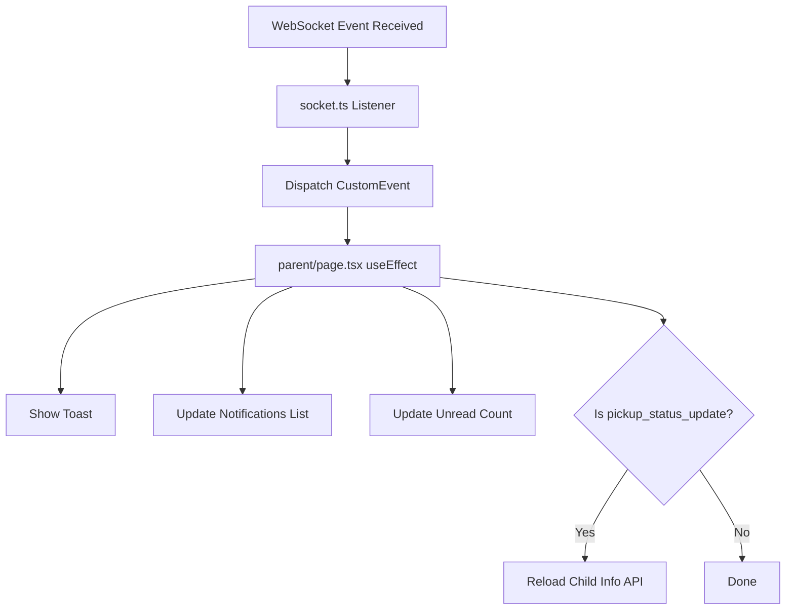

# 📬 M5 - HỆ THỐNG THÔNG BÁO HOÀN CHỈNH

## ✅ TỔNG QUAN

Hệ thống thông báo realtime đầy đủ cho **phụ huynh**, bao gồm tất cả sự kiện quan trọng trong chuyến đi.

---

## 🎯 CÁC SỰ KIỆN ĐƯỢC THÔNG BÁO

### 1. 🚌 Bắt đầu chuyến đi (trip_started)

- **Khi nào**: Tài xế nhấn "Bắt đầu chuyến đi"
- **API**: `POST /api/v1/trips/:id/start`
- **Notification DB**: ✅ Có (ThongBaoModel.createMultiple)
- **WebSocket**: ✅ Có (`notification:new` → `user-{parentId}`)
- **Toast**: ✅ Có
- **File backend**: `TripController.js` (line 812-910)
- **File frontend**: `app/parent/page.tsx` (line 125-195)

**Nội dung thông báo**:

```
Tiêu đề: "Chuyến đi đã bắt đầu"
Nội dung: "Tuyến [Tên tuyến] (Xe [Biển số]) đã khởi hành lúc [Giờ]. Tài xế: [Tên] - [SĐT]"
```

---

### 2. 📍 Xe đến gần điểm dừng (approach_stop)

- **Khi nào**: Xe vào trong bán kính 60m từ điểm dừng
- **Service**: `TelemetryService.checkGeofence()`
- **Notification DB**: ✅ Có (ThongBaoModel.createMultiple)
- **WebSocket**: ✅ Có (`approach_stop` + `notification:new` → `trip-{tripId}`, `user-{parentId}`)
- **Toast**: ✅ Có
- **File backend**: `TelemetryService.js` (line 388-448)
- **File frontend**: Dùng hook `useTripAlerts()` (line 96-126)

**Nội dung thông báo**:

```
Tiêu đề: "Xe đến gần điểm dừng"
Nội dung: "Xe buýt tuyến [Tên tuyến] đang đến gần [Tên điểm dừng] (cách [X]m)"
```

---

### 3. ⏰ Xe bị trễ (delay_alert)

- **Khi nào**: Xe trễ hơn 5 phút so với giờ khởi hành dự kiến
- **Service**: `TelemetryService.checkDelay()`
- **Notification DB**: ✅ Có (ThongBaoModel.createMultiple)
- **WebSocket**: ✅ Có (`delay_alert` + `notification:new` → `trip-{tripId}`, `user-{parentId}`)
- **Toast**: ✅ Có
- **Re-send**: Gửi lại sau mỗi 3 phút (tránh spam)
- **File backend**: `TelemetryService.js` (line 540-615)
- **File frontend**: Dùng hook `useTripAlerts()` (line 96-126)

**Nội dung thông báo**:

```
Tiêu đề: "Xe buýt bị trễ"
Nội dung: "Xe buýt tuyến [Tên tuyến] đang trễ khoảng [X] phút so với dự kiến"
```

---

### 4. ✅ Đón học sinh lên xe (student_checkin)

- **Khi nào**: Tài xế check-in học sinh (đánh dấu "Đã lên xe")
- **API**: `POST /api/v1/trips/:id/students/:studentId/checkin`
- **Notification DB**: ✅ Có (ThongBaoModel.createMultiple)
- **WebSocket**: ✅ Có (`pickup_status_update` + `notification:new` → `trip-{tripId}`, `user-{parentId}`)
- **Toast**: ✅ Có
- **Auto-reload**: ✅ Có (reload child status from API)
- **File backend**: `TripController.js` (line 1220-1330)
- **File frontend**: `app/parent/page.tsx` (line 230-330)

**Nội dung thông báo**:

```
Tiêu đề: "Con đã lên xe"
Nội dung: "[Tên học sinh] đã được đón lên xe buýt [Biển số] tuyến [Tên tuyến]"
```

---

### 5. 🏁 Trả học sinh xuống xe (student_checkout)

- **Khi nào**: Tài xế check-out học sinh (đánh dấu "Đã xuống xe")
- **API**: `POST /api/v1/trips/:id/students/:studentId/checkout`
- **Notification DB**: ✅ Có (ThongBaoModel.createMultiple)
- **WebSocket**: ✅ Có (`pickup_status_update` + `notification:new` → `trip-{tripId}`, `user-{parentId}`)
- **Toast**: ✅ Có
- **Auto-reload**: ✅ Có (reload child status from API)
- **File backend**: `TripController.js` (line 1330-1440)
- **File frontend**: `app/parent/page.tsx` (line 230-330)

**Nội dung thông báo**:

```
Tiêu đề: "Con đã xuống xe"
Nội dung: "[Tên học sinh] đã được trả tại điểm dừng an toàn"
```

---

### 6. ❌ Đánh vắng học sinh (student_absent)

- **Khi nào**: Tài xế đánh dấu học sinh vắng mặt
- **API**: `POST /api/v1/trips/:id/students/:studentId/absent`
- **Notification DB**: ✅ Có (ThongBaoModel.createMultiple)
- **WebSocket**: ✅ Có (`pickup_status_update` + `notification:new` → `trip-{tripId}`, `user-{parentId}`)
- **Toast**: ✅ Có
- **File backend**: `TripController.js` (line 1440-1555)
- **File frontend**: `app/parent/page.tsx` (line 230-330)

**Nội dung thông báo**:

```
Tiêu đề: "Con vắng mặt"
Nội dung: "[Tên học sinh] không có mặt tại điểm đón trên chuyến đi tuyến [Tên tuyến] ([Biển số])"
```

---

### 7. 🚨 Gặp sự cố (trip_incident)

- **Khi nào**: Tài xế báo cáo sự cố khẩn cấp (tai nạn, hỏng xe, v.v.)
- **API**: `POST /api/v1/trips/:id/incident`
- **Request body**: `{ loaiSuCo, moTa, viTri? }`
- **Notification DB**: ✅ Có (ThongBaoModel.createMultiple - gửi cho TẤT CẢ phụ huynh)
- **WebSocket**: ✅ Có (`trip_incident` + `notification:new` → `trip-{tripId}`, `bus-{busId}`, `role-quan_tri`, `user-{parentId}`)
- **Toast**: ✅ Có (màu đỏ - urgent)
- **File backend**: `TripController.js` (line 1555-1665)
- **File frontend**: `app/parent/page.tsx` (line 330-365)

**Nội dung thông báo**:

```
Tiêu đề: "⚠️ Sự cố: [Loại sự cố]"
Nội dung: "Xe buýt tuyến [Tên tuyến] ([Biển số]) đang gặp sự cố: [Mô tả]. Vui lòng liên hệ nhà trường để biết thêm chi tiết."
```

**Ví dụ loại sự cố**:

- "Hỏng xe"
- "Tai nạn giao thông"
- "Học sinh bị ốm"
- "Tắc đường nghiêm trọng"

---

### 8. 🏆 Kết thúc chuyến đi (trip_completed)

- **Khi nào**: Tài xế nhấn "Kết thúc chuyến đi"
- **API**: `POST /api/v1/trips/:id/end`
- **Notification DB**: ✅ Có (ThongBaoModel.createMultiple)
- **WebSocket**: ✅ Có (`trip_completed` + `notification:new` → `trip-{tripId}`, `bus-{busId}`, `role-quan_tri`, `user-{parentId}`)
- **Toast**: ✅ Có
- **File backend**: `TripController.js` (line 950-1090)
- **File frontend**: `app/parent/page.tsx` (line 365-395)

**Nội dung thông báo**:

```
Tiêu đề: "Chuyến đi đã hoàn thành"
Nội dung: "Chuyến đi tuyến [Tên tuyến] ([Biển số]) đã hoàn thành lúc [Giờ]"
```

---

## 📊 BẢNG TỔNG HỢP

| #   | Sự kiện           | API Endpoint                             | WebSocket Event                            | Notification DB | Toast | Frontend Listener                       |
| --- | ----------------- | ---------------------------------------- | ------------------------------------------ | --------------- | ----- | --------------------------------------- |
| 1   | Bắt đầu chuyến đi | `POST /trips/:id/start`                  | `trip_started`, `notification:new`         | ✅              | ✅    | `notificationNew`                       |
| 2   | Gần điểm dừng     | (GPS auto)                               | `approach_stop`, `notification:new`        | ✅              | ✅    | `approachStop`, `notificationNew`       |
| 3   | Xe trễ            | (GPS auto)                               | `delay_alert`, `notification:new`          | ✅              | ✅    | `delayAlert`, `notificationNew`         |
| 4   | Đón học sinh      | `POST /trips/:id/students/:sid/checkin`  | `pickup_status_update`, `notification:new` | ✅              | ✅    | `pickupStatusUpdate`, `notificationNew` |
| 5   | Trả học sinh      | `POST /trips/:id/students/:sid/checkout` | `pickup_status_update`, `notification:new` | ✅              | ✅    | `pickupStatusUpdate`, `notificationNew` |
| 6   | Đánh vắng         | `POST /trips/:id/students/:sid/absent`   | `pickup_status_update`, `notification:new` | ✅              | ✅    | `pickupStatusUpdate`, `notificationNew` |
| 7   | Gặp sự cố         | `POST /trips/:id/incident`               | `trip_incident`, `notification:new`        | ✅              | ✅    | `tripIncident`, `notificationNew`       |
| 8   | Kết thúc          | `POST /trips/:id/end`                    | `trip_completed`, `notification:new`       | ✅              | ✅    | `tripCompleted`, `notificationNew`      |

---

## 🔧 CẤU TRÚC TECHNICAL

### Backend Flow

```mermaid
graph TD
    A[Event Trigger] --> B{Source}
    B -->|API| C[Controller Method]
    B -->|GPS Auto| D[TelemetryService]
    C --> E[Create Notification in DB]
    D --> E
    E --> F[ThongBaoModel.createMultiple]
    F --> G[Insert into ThongBao table]
    E --> H[Emit WebSocket Events]
    H --> I[notification:new → user-{parentId}]
    H --> J[Event-specific → trip-{tripId}/bus-{busId}]
```

### Frontend Flow



---

## 📁 FILES MODIFIED

### Backend

1. **`src/controllers/TripController.js`**

   - Line 812-910: trip_started notification
   - Line 950-1090: trip_completed notification (ADDED)
   - Line 1220-1330: student_checkin notification (ADDED)
   - Line 1330-1440: student_checkout notification (ADDED)
   - Line 1440-1555: student_absent notification (NEW API)
   - Line 1555-1665: trip_incident notification (NEW API)

2. **`src/services/TelemetryService.js`**

   - Line 388-448: approach_stop notification (ADDED)
   - Line 540-615: delay_alert notification (ADDED)

3. **`src/routes/api/trip.js`**
   - Added 4 new routes: checkin, checkout, absent, incident

### Frontend

1. **`lib/socket.ts`**

   - Added listener: `trip_incident` (NEW)
   - Existing: `notification:new`, `pickup_status_update`, `approach_stop`, `delay_alert`, `trip_completed`

2. **`app/parent/page.tsx`**
   - Line 125-195: notificationNew listener (existing)
   - Line 230-330: pickupStatusUpdate listener (existing)
   - Line 330-365: tripIncident listener (NEW)
   - Line 365-395: tripCompleted listener (NEW)
   - Line 96-126: approachStop & delayAlert toasts (via hook)

---

## 🧪 TESTING GUIDE

### 1. Test Bắt đầu chuyến đi

```bash
POST http://localhost:4000/api/v1/trips/1/start
Authorization: Bearer <driver_token>
```

**Kiểm tra**:

- [ ] Phụ huynh nhận toast "Chuyến đi đã bắt đầu"
- [ ] Notification xuất hiện trong danh sách "Thông báo gần đây"
- [ ] Unread count tăng lên

---

### 2. Test Gần điểm dừng

**Cách 1: GPS Simulator**

```bash
cd ssb-backend
node scripts/gps_simulator.js --tripId=1 --speed=40 --interval=3
```

**Cách 2: Manual POST**

```bash
POST http://localhost:4000/api/v1/telemetry
Authorization: Bearer <driver_token>
Content-Type: application/json

{
  "tripId": 1,
  "lat": 21.0285,  // Gần điểm dừng
  "lng": 105.8542,
  "speed": 30,
  "heading": 90
}
```

**Kiểm tra**:

- [ ] Phụ huynh nhận toast "Xe đến gần điểm dừng"
- [ ] Hiển thị tên điểm dừng + khoảng cách
- [ ] Chỉ emit 1 lần cho mỗi điểm dừng (anti-spam)

---

### 3. Test Xe trễ

**Điều kiện**: Xe chạy trễ hơn 5 phút so với giờ khởi hành

**Kiểm tra**:

- [ ] Phụ huynh nhận toast "Xe buýt bị trễ"
- [ ] Hiển thị số phút trễ
- [ ] Re-send sau mỗi 3 phút

---

### 4. Test Check-in học sinh

```bash
POST http://localhost:4000/api/v1/trips/1/students/1/checkin
Authorization: Bearer <driver_token>
Content-Type: application/json

{
  "ghiChu": "Đã lên xe"
}
```

**Kiểm tra**:

- [ ] Phụ huynh nhận toast "Con đã lên xe"
- [ ] Trạng thái học sinh đổi từ "Đang chờ" → "Đang trên xe" (auto-reload)
- [ ] Badge đổi màu: cam → xanh

---

### 5. Test Check-out học sinh

```bash
POST http://localhost:4000/api/v1/trips/1/students/1/checkout
Authorization: Bearer <driver_token>
Content-Type: application/json

{
  "ghiChu": "Đã xuống xe"
}
```

**Kiểm tra**:

- [ ] Phụ huynh nhận toast "Con đã xuống xe"
- [ ] Trạng thái học sinh đổi thành "Đã đón"

---

### 6. Test Đánh vắng

```bash
POST http://localhost:4000/api/v1/trips/1/students/1/absent
Authorization: Bearer <driver_token>
Content-Type: application/json

{
  "ghiChu": "Không có mặt tại điểm đón"
}
```

**Kiểm tra**:

- [ ] Phụ huynh nhận toast "Con vắng mặt"
- [ ] Trạng thái học sinh đổi thành "Vắng"

---

### 7. Test Sự cố

```bash
POST http://localhost:4000/api/v1/trips/1/incident
Authorization: Bearer <driver_token>
Content-Type: application/json

{
  "loaiSuCo": "Hỏng xe",
  "moTa": "Xe bị hỏng động cơ, đang chờ cứu hộ",
  "viTri": {
    "lat": 21.0285,
    "lng": 105.8542
  }
}
```

**Kiểm tra**:

- [ ] Phụ huynh nhận toast đỏ (urgent) "⚠️ Sự cố: Hỏng xe"
- [ ] TẤT CẢ phụ huynh trên chuyến đi đều nhận notification
- [ ] Admin cũng nhận WebSocket event

---

### 8. Test Kết thúc chuyến đi

```bash
POST http://localhost:4000/api/v1/trips/1/end
Authorization: Bearer <driver_token>
Content-Type: application/json

{
  "gioKetThucThucTe": "2025-11-13T08:30:00Z",
  "ghiChu": "Hoàn thành chuyến đi"
}
```

**Kiểm tra**:

- [ ] Phụ huynh nhận toast "Chuyến đi đã hoàn thành"
- [ ] Cache geofence/delay bị clear
- [ ] Bus position bị xóa

---

## 🎨 UI/UX

### Toast Colors

- **Success** (xanh): check-in, checkout, trip completed
- **Info** (xanh dương): trip started, approach stop
- **Warning** (vàng): delay alert, student absent
- **Destructive** (đỏ): trip incident (emergency)

### Notification List

- Hiển thị 10 thông báo gần nhất
- Auto update thời gian ("Vừa xong", "5 phút trước", "1 giờ trước")
- Unread count badge (số thông báo chưa đọc)

---

## 📝 NOTES

1. **Anti-spam mechanisms**:

   - `approach_stop`: Chỉ emit 1 lần cho mỗi điểm dừng trong mỗi trip (dùng `emittedStops` cache)
   - `delay_alert`: Re-send sau mỗi 3 phút (dùng `delayAlertLastSent` cache)

2. **Database persistence**:

   - Tất cả notification đều được lưu vào bảng `ThongBao`
   - Phụ huynh có thể xem lại lịch sử notification qua API `GET /api/v1/notifications`

3. **WebSocket reliability**:

   - Nếu WebSocket disconnect, notification vẫn được lưu trong DB
   - Khi reconnect, frontend có thể fetch lại notification mới qua REST API

4. **Real-time auto-reload**:
   - Khi nhận `pickup_status_update`, frontend tự động reload child info từ API
   - Đảm bảo UI luôn sync với database state

---

## ✅ CHECKLIST HOÀN CHỈNH

- [x] Trip started notification (DB + WS + Toast)
- [x] Approach stop notification (DB + WS + Toast)
- [x] Delay alert notification (DB + WS + Toast)
- [x] Student checkin notification (DB + WS + Toast + Auto-reload)
- [x] Student checkout notification (DB + WS + Toast + Auto-reload)
- [x] Student absent notification (DB + WS + Toast) - NEW
- [x] Trip incident notification (DB + WS + Toast) - NEW
- [x] Trip completed notification (DB + WS + Toast) - NEW
- [x] Frontend listeners cho tất cả events
- [x] API routes cho absent + incident
- [x] Documentation đầy đủ

---

## 🚀 NEXT STEPS

Bây giờ bạn có thể:

1. **Restart backend**:

   ```bash
   cd ssb-backend
   npm run dev
   ```

2. **Restart frontend**:

   ```bash
   cd ssb-frontend
   npm run dev
   ```

3. **Test từng event** theo hướng dẫn trên

4. **Kiểm tra thông báo** trong "Thông báo gần đây" trên parent dashboard

---

**Author**: Nguyễn Tuấn Tài  
**Date**: 2025-11-13  
**Meeting**: M5 - Parent Interface with Complete Real-time Notifications
