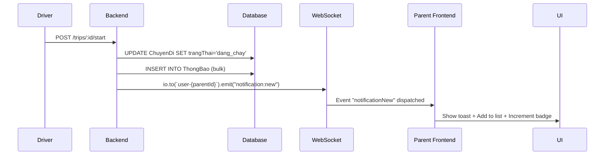

# ✅ FIX HOÀN TẤT - Thông báo realtime cho Phụ huynh

## 🐛 Vấn đề đã fix

**Before**: Phụ huynh không nhận được notification khi tài xế bắt đầu chuyến đi.

**Root Cause**: Parent page chưa listen WebSocket event `notification:new`.

**Solution**: Đã thêm useEffect để listen event và hiển thị thông báo realtime.

---

## ✨ Những gì đã thêm

### **1. State Management** 📊

```typescript
// Lưu trữ danh sách thông báo động
const [recentNotifications, setRecentNotifications] = useState<Array<{...}>>([])
const [unreadCount, setUnreadCount] = useState(0)
```

### **2. WebSocket Listener** 🔌

```typescript
useEffect(() => {
  const handleNotificationNew = (event: CustomEvent) => {
    // 1. Parse notification data
    // 2. Determine type (success/info/warning)
    // 3. Show toast notification
    // 4. Add to notification list
    // 5. Increment unread count
  };

  window.addEventListener("notificationNew", handleNotificationNew);
  return () =>
    window.removeEventListener("notificationNew", handleNotificationNew);
}, [toast]);
```

### **3. Auto Time Update** ⏰

```typescript
// Update "5 phút trước" → "6 phút trước" every minute
useEffect(() => {
  const interval = setInterval(() => {
    // Calculate relative time for each notification
  }, 60000);
  return () => clearInterval(interval);
}, []);
```

### **4. Dynamic UI** 🎨

- Hiển thị "Chưa có thông báo nào" khi empty
- Badge "X mới" hiển thị unread count
- Click notification để mark as read
- Icons động theo type (CheckCircle2, MapPin, AlertCircle)
- Colors động (green/orange/primary)

---

## 🧪 Test ngay bây giờ

### **Step 1: Đăng nhập Tài xế**

```
Email: taixe1@schoolbus.vn
Password: password
```

### **Step 2: Bắt đầu Chuyến 1**

1. Mở http://localhost:3000/driver
2. Click **"Bắt đầu chuyến đi"** cho Tuyến 1

### **Step 3: Đăng nhập Phụ huynh (Incognito)**

```
Email: phuhuynh1@schoolbus.vn
Password: password
```

### **Step 4: Xem Notification** ✅

Bạn sẽ thấy:

1. **Toast popup** góc phải màn hình:

   ```
   🚌 Chuyến đi đã bắt đầu!
   Xe buýt 51A-12345 đã bắt đầu đón con bạn...
   ```

2. **"Thông báo gần đây"** bên phải:
   - Badge "1 mới"
   - Title: "🚌 Chuyến đi đã bắt đầu!"
   - Time: "Vừa xong"
   - Icon: Blue MapPin

---

## 🔄 Flow hoạt động



---

## 📊 Expected Result

### **Parent Dashboard sẽ hiển thị**:

1. **Toast Notification** (Auto dismiss sau 5s):

   ```
   🚌 Chuyến đi đã bắt đầu!
   Xe buýt 51A-12345 đã bắt đầu đón con bạn (Tuyến Quận 7 - Nhà Bè).
   Thời gian: 06:30. Tài xế: Trần Văn Tài.
   ```

2. **Thông báo gần đây**:

   - Badge: "1 mới"
   - Item 1:
     - Icon: Blue info icon (MapPin)
     - Title: "🚌 Chuyến đi đã bắt đầu!"
     - Time: "Vừa xong"

3. **Sau 1 phút**: Time tự động update → "1 phút trước"

4. **Click notification**: Unread count giảm đi 1

---

## 🎯 Các loại notification khác

Ngoài "trip_started", phụ huynh cũng sẽ nhận:

### **1. approach_stop** 🚏

```
🚏 Xe sắp đến điểm dừng!
Xe buýt đang ở cách điểm đón 45m. Thời gian: ~2 phút nữa.
```

- Type: `info`
- Icon: MapPin (blue)

### **2. delay_alert** ⏰

```
⏰ Chuyến đi bị trễ!
Xe buýt trễ hơn dự kiến 7 phút. Vui lòng kiên nhẫn chờ đợi.
```

- Type: `warning`
- Icon: AlertCircle (orange)
- Toast variant: `destructive`

### **3. trip_completed** ✅

```
✅ Chuyến đi hoàn thành!
Xe buýt đã đưa con bạn đến trường an toàn.
```

- Type: `success`
- Icon: CheckCircle2 (green)

---

## 🛠️ Files đã sửa

### **Backend**: `ssb-backend/src/controllers/TripController.js`

- ✅ Import `ThongBaoModel`
- ✅ Thêm logic gửi bulk notifications
- ✅ Emit `notification:new` event cho từng parent

### **Frontend**: `ssb-frontend/app/parent/page.tsx`

- ✅ State: `recentNotifications`, `unreadCount`
- ✅ Listen event: `notificationNew`
- ✅ Toast notification
- ✅ Dynamic notification list
- ✅ Auto time update
- ✅ Click to mark read

---

## 📸 Screenshots Expected

1. **Toast popup**: Top-right corner, blue background
2. **Notification list**: Right sidebar, "1 mới" badge
3. **After 1 min**: Time changes to "1 phút trước"
4. **After click**: Badge changes to "0 mới" or disappears

---

## 🚀 Next Steps

Bây giờ test lại:

1. ✅ Restart backend: `cd ssb-backend && npm run dev`
2. ✅ Restart frontend: `cd ssb-frontend && npm run dev`
3. ✅ Login driver → Start trip
4. ✅ Login parent (Incognito) → Check notification!

**Happy Testing! 🎉**
