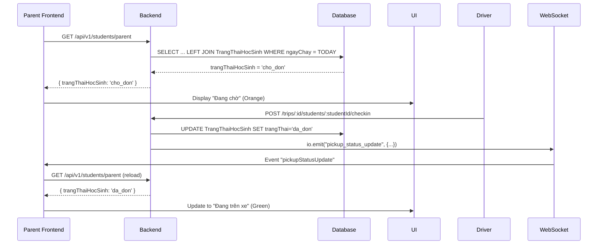

# ✅ FIX: Trạng thái học sinh hiển thị sai

## 🐛 Vấn đề

**Reported**: Giao diện phụ huynh hiển thị "Nguyễn Gia Bảo - Đang trên xe" mặc dù:

- Tài xế chưa đến điểm dừng
- Chưa tick check-in cho học sinh

**Root Cause**:

1. Frontend chỉ dựa vào `tripStatus === "dang_chay"` để hiển thị "on-bus"
2. Backend API `getByParent()` không trả về trạng thái thực tế từ `TrangThaiHocSinh`
3. Frontend không listen WebSocket event `pickup_status_update`

---

## ✨ Solution đã implement

### **1. Backend - HocSinhModel.js** 🔧

**Sửa API `getByParent()`**:

- ✅ JOIN với `TrangThaiHocSinh` để lấy trạng thái thực tế
- ✅ JOIN với `ChuyenDi`, `LichTrinh`, `TuyenDuong`, `XeBuyt`, `TaiXe`
- ✅ Filter theo `CURDATE()` để chỉ lấy chuyến đi hôm nay
- ✅ Return `tripInfo` object với đầy đủ thông tin: `trangThaiHocSinh`, `bienSoXe`, `tenTaiXe`, `sdtTaiXe`, etc.

**SQL Query mới**:

```sql
SELECT
  hs.*,
  tts.trangThai as trangThaiHocSinh,
  tts.maChuyen,
  cd.trangThai as trangThaiChuyen,
  lt.gioKhoiHanh,
  xb.bienSoXe,
  tx.tenTaiXe,
  nd_tx.soDienThoai as sdtTaiXe
FROM HocSinh hs
LEFT JOIN TrangThaiHocSinh tts ON hs.maHocSinh = tts.maHocSinh
LEFT JOIN ChuyenDi cd ON tts.maChuyen = cd.maChuyen AND cd.ngayChay = CURDATE()
...
WHERE hs.maPhuHuynh = ?
```

### **2. Frontend - parent/page.tsx** 🎨

**Sửa logic map trạng thái**:

```typescript
// OLD (WRONG):
status: tripInfo.trangThai === "dang_chay" ? "on-bus" : "waiting";

// NEW (CORRECT):
const studentStatus = firstChild.trangThaiHocSinh || "cho_don";
let displayStatus = "waiting";

if (studentStatus === "da_don") {
  displayStatus = "on-bus"; // Đã lên xe
} else if (studentStatus === "da_tra") {
  displayStatus = "picked-up"; // Đã được đưa đến nơi
} else {
  displayStatus = "waiting"; // Chờ đón
}
```

**Thêm realtime update**:

- ✅ Listen event `pickupStatusUpdate` từ WebSocket
- ✅ Auto reload child info khi có student check-in/out
- ✅ Update UI realtime không cần refresh page

### **3. Socket - socket.ts** 🔌

**Thêm listener mới**:

```typescript
this.socket.on("pickup_status_update", (data) => {
  console.log("Pickup status update:", data);
  window.dispatchEvent(new CustomEvent("pickupStatusUpdate", { detail: data }));
});
```

---

## 📊 Status Mapping

| Database Value | Display Status | Badge Text   | Badge Color |
| -------------- | -------------- | ------------ | ----------- |
| `cho_don`      | `waiting`      | Đang chờ     | Orange      |
| `da_don`       | `on-bus`       | Đang trên xe | Green       |
| `da_tra`       | `picked-up`    | Đã đón       | Green       |
| `vang`         | `waiting`      | Đang chờ     | Orange      |

---

## 🔄 Flow hoạt động



---

## 🧪 Test Case

### **Before Fix**:

1. Login parent → See "Nguyễn Gia Bảo - Đang trên xe" ❌
2. Database: `TrangThaiHocSinh.trangThai = 'cho_don'` (chưa đón)
3. **Mismatch!**

### **After Fix**:

1. Login parent → See "Nguyễn Gia Bảo - Đang chờ" ✅
2. Driver check-in student
3. Parent UI auto update to "Đang trên xe" ✅
4. Database: `TrangThaiHocSinh.trangThai = 'da_don'`
5. **Correct!**

---

## 📂 Files Changed

1. **Backend**:

   - `ssb-backend/src/models/HocSinhModel.js` (+40 lines)
     - Sửa `getByParent()` method

2. **Frontend**:

   - `ssb-frontend/lib/socket.ts` (+8 lines)

     - Thêm `pickup_status_update` listener

   - `ssb-frontend/app/parent/page.tsx` (+60 lines)
     - Sửa logic map status từ database values
     - Thêm realtime listener cho pickup updates
     - Auto reload child info

---

## 🚀 Restart để test

```bash
# Terminal 1 - Backend
cd ssb-backend
npm run dev

# Terminal 2 - Frontend
cd ssb-frontend
npm run dev
```

---

## ✅ Expected Result

### **1. Initial Load (chưa check-in)**:

- Badge: "Đang chờ" (Orange)
- Icon: Clock (orange)
- Text: "Còn 5 phút"

### **2. After Driver Check-in**:

- Badge: "Đang trên xe" (Green)
- Icon: Green pulse dot
- Text: "Đang trên xe"
- **UI tự động update không cần refresh!**

### **3. After Driver Check-out**:

- Badge: "Đã đón" (Green)
- Icon: CheckCircle2 (green)

---

## 🎯 Key Changes Summary

| Before                                 | After                                         |
| -------------------------------------- | --------------------------------------------- |
| Status từ Trip status                  | Status từ TrangThaiHocSinh                    |
| Hard-coded "on-bus" khi trip đang chạy | Dynamic dựa vào 'cho_don', 'da_don', 'da_tra' |
| Không realtime                         | Realtime qua WebSocket                        |
| Phải refresh page                      | Auto update                                   |

---

**Happy Testing! 🎉**
