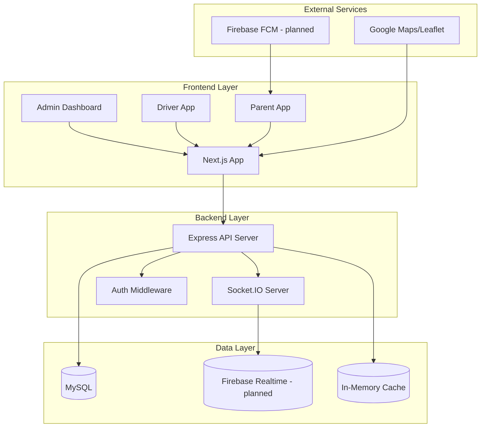

# TÀI LIỆU KIẾN TRÚC HỆ THỐNG SMART SCHOOL BUS TRACKING (SSB 1.0)

**Phiên bản:** 1.0
**Ngày cập nhật:** 2025-10-23
**Phạm vi:** Toàn hệ thống (FE, BE, DB, Realtime)

---
## 1) Phương án kiến trúc đã chọn

**Mô tả ngắn:** Next.js (Frontend) ↔ Node.js/Express (Backend) ↔ MySQL (nghiệp vụ) + Socket.IO (realtime) + Firebase (dự kiến push/FCM)

**Lý do chọn:**

* **Realtime tracking:** Socket.IO đáp ứng độ trễ P95 ≤ 3 giây cho cập nhật GPS.
* **Mở rộng & bảo trì:** Phân tách FE/BE/DB rõ ràng, sẵn sàng tách dịch vụ theo module (microservice-ready).
* **Khả dụng:** Hỗ trợ ≥ 300 xe đồng thời (1–3s/ping), có cơ chế reconnect và backoff.

**Sơ đồ tổng quan (Mermaid):**



---

## 2) Danh mục module & sơ đồ

**Tổng số module:** 9 (M0…M8)

1. **M0: Identity & Access** – Xác thực/Phân quyền (JWT + roles)
2. **M1: User & Asset Management** – Quản lý người dùng/xe/tài xế/học sinh
3. **M2: Route & Stop Management** – Tuyến đường & điểm dừng
4. **M3: Scheduler & Assignment** – Lập lịch & phân công xe/tài xế
5. **M4: Realtime Tracking** – Nhận GPS & broadcast realtime
6. **M5: Trip Execution & Attendance** – Thực thi chuyến & điểm danh
7. **M6: Notification & Alerting** – Cảnh báo, in-app/FCM (dự kiến)
8. **M7: Reporting & Analytics** – Báo cáo thống kê & biểu đồ
9. **M8: Admin & Configuration** – Cấu hình hệ thống & dashboard quản trị

> **Chuẩn REST:** Toàn bộ ví dụ API dùng prefix **`/api/v1/`**.

---

## 3) Chi tiết từng module

### M0 — Identity & Access (AuthN/AuthZ)

**Mã nguồn gợi ý:** `ssb-backend/src/controllers/AuthController.js`, `ssb-backend/src/middlewares/AuthMiddleware.js`

**Chức năng cốt lõi:**

* Đăng ký/đăng nhập; phát hành/kiểm tra JWT.
* Phân quyền 3 vai trò: `quan_tri`, `tai_xe`, `phu_huynh`.
* Hồ sơ người dùng (đổi thông tin, đổi mật khẩu).

**Input/Output tóm tắt:**

* **Input:** Email/password, JWT Bearer header.
* **Output:** `{ token, user }`, `{ user }`, mã lỗi 4xx hợp lý.

**REST API:**

|Method| Path                           | Handler                       | Middlewares  | Request (params/query/body)         | Response(status+JSON)|
| ---- | ------------------------------ | ----------------------------- | ------------ | ----------------------------------- | -------------------- |
| POST | `/api/v1/auth/register`        | AuthController.register       | –            | `{ hoTen, email, matKhau, vaiTro }` | `201 { user, token }`|
| POST | `/api/v1/auth/login`           | AuthController.login          | –            | `{ email, matKhau }`                | `200 { user, token }`|
| GET  | `/api/v1/auth/profile`         | AuthController.getProfile     | authenticate | –                                   | `200 { user }`       |
| PUT  | `/api/v1/auth/profile`         | AuthController.updateProfile  | authenticate | `{ hoTen?, soDienThoai? }`          | `200 { user }`       |
| POST | `/api/v1/auth/change-password` | AuthController.changePassword | authenticate | `{ matKhauCu, matKhauMoi }`         | `200 { message }`    |

**Data Store:**

| Store | Bảng        | Mục đích             | Khoá/Index                           | Ghi chú                           |
| ----- | ----------- | -------------------- | ------------------------------------ | --------------------------------- |
| MySQL | `NguoiDung` | Người dùng & vai trò | `maNguoiDung` (PK), `email` (UNIQUE) | Hash mật khẩu (bcrypt ≥10 rounds) |
| MySQL | `TaiXe`     | Hồ sơ tài xế (FK)    | `maTaiXe` (PK), FK→`NguoiDung`       | Mở rộng thuộc tính nghề nghiệp    |

---

### M1 — User & Asset Management

**Mã nguồn gợi ý:** `src/controllers/BusController.js`, `DriverController.js`, `StudentController.js`

**Chức năng cốt lõi:** CRUD xe, tài xế, học sinh, phụ huynh; liên kết phụ huynh–học sinh; cập nhật vị trí xe (endpoint).

**Input/Output:**

* **Input:** Form/filter từ FE; toạ độ từ driver app (khi cập nhật vị trí qua REST).
* **Output:** JSON danh sách/chi tiết; sự kiện realtime (status/location) nếu có.

**REST API (trích yếu):**

| Method | Path                         | Handler                      | Middlewares                | Request                            | Response               |
| --- | ----------------------------| ----------------------------| --------------------------| ----------------------------------| ----------------------|
| GET | `/api/v1/buses`             | BusController.getAll        | authenticate, requireAdmin| `?page,limit,search`              | `{ data, pagination }`|
| POST| `/api/v1/buses`             | BusController.create        | authenticate, requireAdmin| `{ bienSoXe, dongXe, sucChua }`   | `{ bus }`             |
| PUT | `/api/v1/buses/:id`         | BusController.update        | authenticate, requireAdmin| `{ bienSoXe?, dongXe?, sucChua? }`| `{ bus }`             |
| POST| `/api/v1/buses/:id/position`| BusController.updateLocation| authenticate              | `{ viDo, kinhDo, tocDo? }`        | `{ location }`        |
| GET | `/api/v1/drivers`           | DriverController.getAll     | authenticate, requireAdmin| `?page,limit,status`              | `{ data, pagination }`|

**Realtime Events:**

| Channel/Room  | Event             | Publisher     | Subscriber | Payload                                    |
| ------------- | ----------------- | ------------- | ---------- | ------------------------------------------ |
| `bus-{busId}` | `location_update` | BusController | FE clients | `{ busId, location{lat,lng}, speed?, ts }` |
| `bus-{busId}` | `status_update`   | BusController | FE clients | `{ busId, status, reason?, ts }`           |

**Data Store:**

| Store | Bảng      | Mục đích          | Khoá        |
| ----- | --------- | ----------------- | ----------- |
| MySQL | `XeBuyt`  | Danh mục xe       | `maXe`      |
| MySQL | `TaiXe`   | Danh mục tài xế   | `maTaiXe`   |
| MySQL | `HocSinh` | Danh mục học sinh | `maHocSinh` |

---

### M2 — Route & Stop Management

**Mã nguồn gợi ý:** `RouteController.js`, `models/TuyenDuongModel.js`

**Chức năng cốt lõi:** Tuyến/điểm dừng; thứ tự & giờ dự kiến; gán học sinh vào điểm dừng.

**REST API:**

| Method| Path                       | Handler                  | Middlewares                | Request                                 | Response     |
| ------|--------------------------|------------------------|--------------------------| ---------------------------------------|------------|
| GET   |`/api/v1/routes`          |RouteController.getAll  |authenticate              | `?page,limit`                          |`{ routes }`|
| POST  |`/api/v1/routes`          |RouteController.create  |authenticate, requireAdmin| `{ tenTuyen, diemBatDau, diemKetThuc }`|`{ route }` |
| GET   |`/api/v1/routes/:id/stops`|RouteController.getStops|authenticate              | –                                      |`{ stops }` |

**Data Store:**

| Store | Bảng         | Mục đích    | Khoá                      |
| ----- | ------------ | ----------- | ------------------------- |
| MySQL | `TuyenDuong` | Tuyến đường | `maTuyen`                 |
| MySQL | `DiemDung`   | Điểm dừng   | `maDiem`, FK→`TuyenDuong` |

---

### M3 — Scheduler & Assignment

**Mã nguồn gợi ý:** `ScheduleController.js`, `models/LichTrinhModel.js`

**Chức năng cốt lõi:** Lập lịch theo ngày/tuần; gán xe/tài xế; sinh chuyến theo lịch.

**REST API:**

|Method|Path                          | Handler                 |Middlewares               |Request                                  |Response       |
|------|------------------------------|-------------------------|--------------------------|-----------------------------------------|---------------|
|GET   |`/api/v1/schedules`           |ScheduleController.getAll|authenticate              |`{ date?, busId?, driverId? }`           |`{ schedules }`|
|POST  |`/api/v1/schedules`           |ScheduleController.create|authenticate, requireAdmin|`{ maTuyen, maXe, maTaiXe, gioKhoiHanh }`|`{ schedule }` |
|POST  |`/api/v1/schedules/:id/assign`|ScheduleController.assign|authenticate, requireAdmin|`{ busId, driverId }`                    |`{ schedule }` |

**Data Store:**

| Store | Bảng        | Mục đích  | Khoá          |
| ----- | ----------- | --------- | ------------- |
| MySQL | `LichTrinh` | Lịch chạy | `maLichTrinh` |

---

### M4 — Realtime Tracking

**Mã nguồn gợi ý:** `src/server.js`, `src/controllers/BusController.js`

**Chức năng cốt lõi:** Nhận GPS từ driver; cập nhật cache/Firebase (dự kiến); phát sự kiện Socket.IO.

**WS Auth & Rooms:**

* Áp dụng `io.use(authMiddleware)` để kiểm JWT khi `connection`.
* Kiểm quyền khi `join("bus-{busId}")`, `join("trip-{tripId}")`, `join("user-{userId}")`.

**Realtime Events:**

|Channel      |Event                |Publisher     |Subscriber             |Payload                                   |Trigger                    |
|-------------|---------------------|--------------|-----------------------|------------------------------------------|---------------------------|
|`bus-{busId}`|`bus_position_update`|Server        |Admin/Parent dashboards|`{ busId, position{lat,lng}, speed?, ts }`|Driver update GPS (REST/WS)|
|`bus-{busId}`|`trip_started`       |TripController|FE clients             |`{ tripId, busId, startTime }`            |Start trip                 |
|`bus-{busId}`|`trip_completed`     |TripController|FE clients             |`{ tripId, busId, endTime }`              |End trip                   |

**Data Store:**

| Store              | Key/Bảng                            | Mục đích            | Ghi chú                                         |
| ------------------ | ----------------------------------- | ------------------- | ----------------------------------------------- |
| In-memory          | `current_position:{busId}`          | Vị trí tức thời     | TTL ngắn, không lưu lịch sử                     |
| Firebase (planned) | `tracking/{busId}/current_location` | Lưu realtime/backup | Giới hạn N điểm gần nhất để tránh phình dữ liệu |

---

### M5 — Trip Execution & Attendance

**Mã nguồn gợi ý:** `TripController.js`, `models/ChuyenDiModel.js`

**Chức năng cốt lõi:** Bắt đầu/kết thúc chuyến; điểm danh; nhật ký sự kiện chuyến.

**REST API:**

|Method|Path                                          |Handler                           |Middlewares                |Request                    |Response    |
|------|----------------------------------------------|----------------------------------|---------------------------|---------------------------|------------|
|GET   |`/api/v1/trips`                               |TripController.getAll             |authenticate               |`{ ngayChay?, trangThai? }`|`{ trips }` |
|POST  |`/api/v1/trips/:id/start`                     |TripController.startTrip          |authenticate, requireDriver|`{ gioBatDauThucTe? }`     |`{ trip }`  |
|POST  |`/api/v1/trips/:id/end`                       |TripController.endTrip            |authenticate, requireDriver|`{ gioKetThucThucTe? }`    |`{ trip }`  |
|POST  |`/api/v1/trips/:id/students/:studentId/status`|TripController.updateStudentStatus|authenticate               |`{ trangThai }`            |`{ status }`|

**Data Store:**

| Store | Bảng               | Mục đích     | Khoá                                          |
| ----- | ------------------ | ------------ | --------------------------------------------- |
| MySQL | `ChuyenDi`         | Chuyến đi    | `maChuyen`                                    |
| MySQL | `TrangThaiHocSinh` | Check-in/out | `maTrangThai`, UNIQUE(`maChuyen`,`maHocSinh`) |

---

### M6 — Notification & Alerting

**Mã nguồn gợi ý:** `ssb-backend/src/config/env.example` (Firebase config), components FE subscribe Socket.

**Chức năng cốt lõi:** Cảnh báo trễ, đến gần điểm dừng, sự cố; in-app notifications; (dự kiến) push FCM.

**Realtime:**

| Channel                  | Event          | Publisher | Subscriber    | Payload                          |
| ------------------------ | -------------- | --------- | ------------- | -------------------------------- |
| `notifications-{userId}` | `notification` | System    | User clients  | `{ title, message, type, ts }`   |
| `alerts-admin`           | `system_alert` | System    | Admin clients | `{ alert, severity, timestamp }` |

**Data Store:**

| Store | Bảng       | Mục đích          | Khoá         |
| ----- | ---------- | ----------------- | ------------ |
| MySQL | `ThongBao` | Nhật ký thông báo | `maThongBao` |
| MySQL | `SuCo`     | Sự cố/chú thích   | `maSuCo`     |

---

### M7 — Reporting & Analytics

**Mã nguồn gợi ý:** FE charts (ví dụ: `components/admin/*chart*.tsx`), các endpoint thống kê BE.

**Chức năng cốt lõi:** Thống kê xe/chuyến; tỉ lệ đúng giờ; thời lượng trung bình; biểu đồ dashboard.

**REST API (tham chiếu):**

|Method|Path                 |Handler                |Middlewares               |Request                      |Response                             |
|------|---------------------|-----------------------|--------------------------|-----------------------------|-------------------------------------|
|GET   |`/api/v1/buses/stats`|BusController.getStats |authenticate, requireAdmin|–                            |`{ total, byStatus, byCapacity }`    |
|GET   |`/api/v1/trips/stats`|TripController.getStats|authenticate, requireAdmin|`{ ngayBatDau, ngayKetThuc }`|`{ completionRate, averageDuration }`|

**Data Store:**

| Store | Bảng                 | Mục đích              |
| ----- | -------------------- | --------------------- |
| MySQL | `ChuyenDi`, `XeBuyt` | Nguồn dữ liệu báo cáo |

---

### M8 — Admin & Configuration

**Mã nguồn gợi ý:** `ssb-frontend/app/admin/`, `components/admin/`

**Chức năng cốt lõi:** Cấu hình hệ thống (ngưỡng trễ, bán kính điểm dừng), quản trị tài khoản, audit log (nếu có), dashboard tổng quan.

**REST (ví dụ):**

|Method|Path                         |Handler                         |Middlewares               |Request                                |Response              |
|------|-----------------------------|--------------------------------|--------------------------|---------------------------------------|----------------------|
|PUT   |`/api/v1/settings/thresholds`|AdminController.updateThresholds|authenticate, requireAdmin|`{ late_min_threshold, stop_radius_m }`|`{ status:"updated" }`|

---

## 4) Frontend mapping

**Pages/Routes chính:**

| Route                   | Component                           | Module | Mô tả                  |
| ----------------------- | ----------------------------------- | ------ | ---------------------- |
| `/login`                | `app/login/page.tsx`                | M0     | Đăng nhập đa vai trò   |
| `/admin`                | `app/admin/page.tsx`                | M8     | Dashboard quản trị     |
| `/admin/buses`          | `app/admin/buses/page.tsx`          | M1     | Quản lý xe buýt        |
| `/admin/drivers`        | `app/admin/drivers/page.tsx`        | M1     | Quản lý tài xế         |
| `/admin/routes`         | `app/admin/routes/page.tsx`         | M2     | Quản lý tuyến          |
| `/admin/schedule`       | `app/admin/schedule/page.tsx`       | M3     | Lập lịch               |
| `/admin/tracking`       | `app/admin/tracking/page.tsx`       | M4     | Theo dõi realtime      |
| `/driver`               | `app/driver/page.tsx`               | M5     | Bảng điều khiển tài xế |
| `/driver/trip/[id]`     | `app/driver/trip/[id]/page.tsx`     | M5     | Thực thi chuyến        |
| `/parent`               | `app/parent/page.tsx`               | M6     | Bảng phụ huynh         |
| `/parent/notifications` | `app/parent/notifications/page.tsx` | M6     | Thông báo              |

**State & Realtime:**

* `lib/auth-context.tsx` (AuthContext) quản lý phiên đăng nhập.
* Socket.IO subscribe trong component tracking/notification; dùng rooms theo `busId`, `userId`.
* Bản đồ: Google Maps/Leaflet ở FE; gọi API lấy stops/routes + subscribe `bus_position_update`.

---

## 5) Bảo mật & Cấu hình

**Authentication/Authorization**

* JWT access (15–60 phút) + (khuyến nghị) refresh (7–30 ngày) nếu cần; revoke theo blacklist/rotation.
* Middleware: `authenticate`, `requireAdmin`, `requireDriver`.

**WebSocket Security**

* `io.use(authMiddleware)` kiểm JWT; kiểm quyền khi tham gia room.
* Namespace/Room: `bus-{busId}`, `trip-{tripId}`, `user-{userId}`.

**ENV (ví dụ `.env.example`):**

```env
PORT=3001
NODE_ENV=development
FRONTEND_URL=http://localhost:5173
DB_HOST=localhost
DB_USER=root
DB_PASSWORD=your_password_here
DB_NAME=smart_school_bus
JWT_SECRET=your_super_secret_jwt_key_here
FIREBASE_PROJECT_ID=your_firebase_project_id
FIREBASE_PRIVATE_KEY=your_firebase_private_key
FIREBASE_CLIENT_EMAIL=your_firebase_client_email
```

**CORS & Headers**

* Cấu hình CORS theo `FRONTEND_URL`.
* Helmet headers; rate limiting (đề xuất) cho `/auth/*` và `/api/v1/*`.

---

## 6) Sơ đồ dữ liệu (rút gọn)

**Quan hệ chính:**

* `NguoiDung (1) — (1) TaiXe`
* `NguoiDung (1) — (N) HocSinh`
* `TuyenDuong (1) — (N) LichTrinh`
* `XeBuyt (1) — (N) LichTrinh`
* `LichTrinh (1) — (N) ChuyenDi`
* `ChuyenDi (1) — (N) TrangThaiHocSinh`

**Index/Ràng buộc gợi ý:**

* `TrangThaiHocSinh`: UNIQUE(`maChuyen`,`maHocSinh`)
* `ChuyenDi`: INDEX(`maLichTrinh`, `thoiGianBatDau`)
* FK nhạy cảm quy ước CASCADE/SET NULL phù hợp quy trình xóa.

**Firebase Realtime (planned):**

* `buses/{busId}/current_location`
* `trips/{tripId}/status`
* `notifications/{userId}/messages`

---

## 7) Ràng buộc phi chức năng (NFR)

**Hiệu năng realtime**

* **P95 latency ≤ 3s** cho `bus_position_update`.
* Reconnect ≤ 5s; chịu lỗi mất 1–2 ping.
* Throughput mục tiêu: ≥ 300 xe, 1–3s/ping (≈ 100–300 msg/s).

**Bảo mật**

* Hash mật khẩu (bcrypt ≥10 rounds); JWT secrets qua ENV/KMS.
* RBAC theo vai trò; kiểm quyền socket room.

**Khả năng mở rộng & vận hành**

* Connection pooling cho MySQL; (đề xuất) Redis cho rate limit & pub/sub scale-out.
* Observability: structured logs, request ID, latency metrics.

---

## 8) Phạm vi & Giả định

* Tài liệu dựa trên cấu trúc mã quen thuộc của dự án SSB 1.0. Nếu endpoint/luồng/FCM chưa có trong repo hiện tại → đánh dấu **planned** hoặc **gợi ý** ở trên.
* Không bịa đặt API/DB không tồn tại; khi triển khai khác biệt, cần cập nhật lại tài liệu này.

---

## 9) Phụ lục — Ánh xạ Module ↔ Files chính

|Module|Backend Files (gợi ý)                                                                                |Frontend Files (gợi ý)                                                |
|------|-----------------------------------------------------------------------------------------------------|----------------------------------------------------------------------|
|M0    |`controllers/AuthController.js`, `middlewares/AuthMiddleware.js`                                     |`app/login/page.tsx`, `lib/auth-context.tsx`                          |
|M1    |`controllers/BusController.js`, `controllers/DriverController.js`, `controllers/StudentController.js`|`app/admin/buses/page.tsx`, `app/admin/drivers/page.tsx`              |
|M2    |`controllers/RouteController.js`, `models/TuyenDuongModel.js`                                        |`app/admin/routes/page.tsx`                                           |
|M3    |`controllers/ScheduleController.js`, `models/LichTrinhModel.js`                                      |`app/admin/schedule/page.tsx`                                         |
|M4    |`src/server.js`, `controllers/BusController.js`                                                      |`components/admin/tracking-map.tsx`                                   |
|M5    |`controllers/TripController.js`, `models/ChuyenDiModel.js`                                           |`app/driver/trip/[id]/page.tsx`                                       |
|M6    |`config/env.example` (Firebase planned)                                                              |`app/parent/notifications/page.tsx`, `components/ui/floating-chat.tsx`|
|M7    |`*Controller.getStats` endpoints                                                                     |`components/admin/*chart*.tsx`                                        |
|M8    |`AdminController.*` (nếu có)                                                                         |`app/admin/*`, `components/admin/*`                                   |
